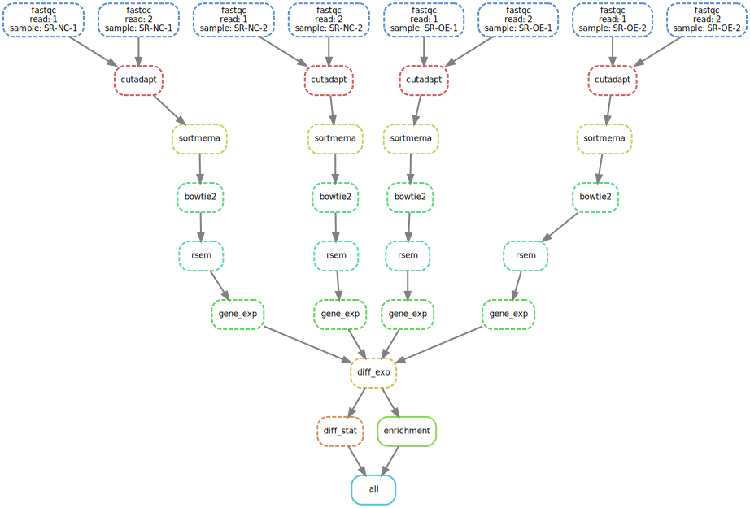

### RNA-Seq-snakemake
The repository is a convenient snakemake pipeline for RNA-Seq analysis.

workflow of the pipeline


#### Step 1: config.yaml
First, he config.yaml should be edited. If you don't know YAML ,the link is useful[yaml](https://www.cloudbees.com/blog/yaml-tutorial-everything-you-need-get-started).

```bash
cat config.yaml
samples:
  SR-NC-1: data/samples/SR-NC-1/SR-NC-1_1.fq.gz,data/samples/SR-NC-1/SR-NC-1_2.fq.gz
  SR-NC-2: data/samples/SR-NC-2/SR-NC-2_1.fq.gz,data/samples/SR-NC-2/SR-NC-2_2.fq.gz
  SR-OE-1: data/samples/SR-OE-1/SR-OE-1_1.fq.gz,data/samples/SR-OE-1/SR-OE-1_2.fq.gz
  SR-OE-2: data/samples/SR-OE-2/SR-OE-2_1.fq.gz,data/samples/SR-OE-2/SR-OE-2_2.fq.gz


diff_group:
  Control:
    SR-NC-1
    SR-NC-2
  Treat:
    SR-OE-1
    SR-OE-2

adapter:
  forward: AGATCGGAAGAGCACACGTCTGAACTCCAGTCAC
  backward: AGATCGGAAGAGCGTCGTGTAGGGAAAGAGTGTA

software:
  fastqc: /home/zhusitao/anaconda3/envs/snakemake/bin/fastqc
  cutadapt: /home/zhusitao/anaconda3/bin/cutadapt
  sortmerna: /home/zhusitao/software/sortmerna-4.3.4-Linux/bin/sortmerna
  bowtie2: /home/zhusitao/anaconda3/bin/bowtie2
  samtools: /home/zhusitao/anaconda3/bin/samtools
  Rscript: /home/zhusitao/anaconda3/envs/R/bin/Rscript

USED_GTF: "/path/GTF/ath.gtf"
```


#### Step 2: snakemake
Define an edited snakemake

#### Step 3: execute
```bash
nohup snakemake --snakefile Snakefile --configfile config.yaml --cores 50 --latency-wait 100 &
```
